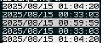

# better-timestamps.xplr

An [xplr](https://github.com/sayanarijit/xplr) plugin that formats and highlights last-edited file timestamps based on time since edit.



# Why:

Seeing how recently a file was edited in a more immediate way can help you keep track of what has been edited recently.  Also, gradients!

# Parameters:

* `color_func` (default range between `232` (black) and `255` (white)): A function that, given the output of `time_curve`, returns an integer ansi color code.  See [this comment](https://gist.github.com/JBlond/2fea43a3049b38287e5e9cefc87b2124?permalink_comment_id=3892823#gistcomment-3892823) for a visual display of colors to codes.  This value must be an integer.  If it is not, it will be automatically rounded to the nearest integer.
* `format` (default `"%a %b %d %X %Y"`, identical to xplr default): The format string to display the date with.  See [the lua docs](https://www.lua.org/pil/22.1.html) for more information.
* `length` (default `24`): The column width of the date column.  This should be long enough to fit your `format` for any date.
* `time_curve` (default interpolates last edited time between startup and current time): A function that, when given the last modified timestamp in seconds, returns a float between 0 and 1.  If it is not, it will be clamped to between those two values. 
* `unedited_transparent` (default 0.04): the value returned by `time_curve` function that the background of the timestamp should be transparent when less than.

# Installation:

I recommend using the [xpm](https://github.com/dtomvan/xpm.xplr) plugin manager, or some other plugin manager.

You can either use the defaults:
```lua
require("xpm").setup({
	...
	'LyxHuston/better-timestamps.xplr'
	...
})
```

Or customize it:
```lua
require("xpm").setup({
	...
	{
		name = 'LyxHuston/better-timestamps.xplr',
		setup = {
			length = 25
		}
	}
	...
})
```


To use it manually:

* Clone the plugin:

```bash
mkdir -p ~/.config/xplr/plugins

git clone https://github.com/LyxHuston/better-timestamps.xplr ~/.config/xplr/plugins/better-timestamps
```

* Add the following lines in `~/.config/xplr/init.lua`:

```lua
local home = os.getenv("HOME")
package.path = home
.. "/.config/xplr/plugins/?/init.lua;"
.. home
.. "/.config/xplr/plugins/?.lua;"
.. package.path

require("better-timestamps").setup()
-- or
require("better-timestamps").setup({
	length = 25
})
```
